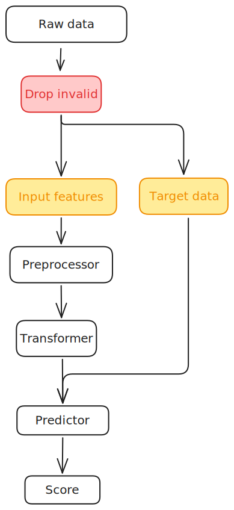









## The pipeline {background-image="images/pipeline.svg" background-size="auto 90%" background-position="center center" background-repeat="no-repeat"}





## Step: Drop invalid data --- `Cleaner` {.smaller}

:::: {.columns}
::: {.column width="35%"}

  
  

:::
::: {.column width="65%"}

Skrub's **`Cleaner`** removes and repairs invalid rows before splitting features from target.

:::
::::





## Step: Transformer {.smaller}

:::: {.columns}
::: {.column width="35%"}

  
  

:::
::: {.column width="65%"}

Encoding dates, scaling numerics, encoding categoricals — all through skrub's column transformers.

:::
::::



<!--  -->



<!--  -->







## Column transformations with `ApplyToCols` {.smaller auto-animate="true"}

{fig-align="center"}

## Step: Predictor {.smaller}

:::: {.columns}
::: {.column width="35%"}

  
  

:::
::: {.column width="65%"}

Assembling the full scikit-learn pipeline with a final estimator.

:::
::::





# What if this is not enough? 

















# Wrapping up







